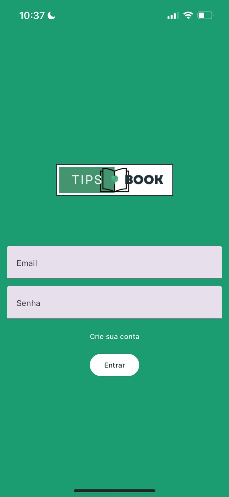
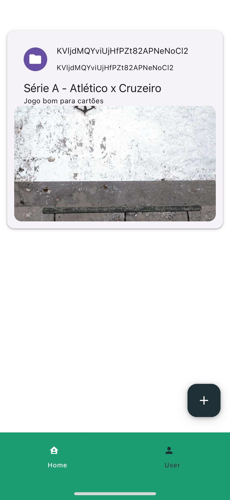
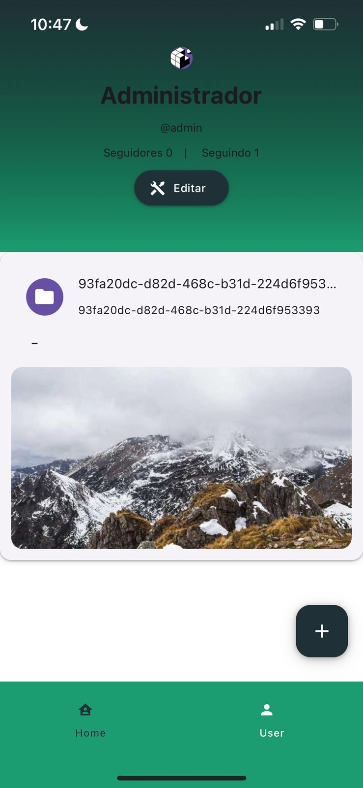

# Tips book

A social media for share tips and to compete with friends. Furthermore, you can track your profits 😄🍀

[](https://app.codacy.com/gh/rogigs/tips-book/dashboard?utm_source=gh&utm_medium=referral&utm_content=&utm_campaign=Badge_grade)

|  |  |  |
| --------------------------------------------------------------------- | --------------------------------------------------------------------- | ----------------------------------------------------------------------- |

## Roadmap

- Add main components

- Add a server to project

- UX/UI (In Progress...🚧)

  - Main components
  - Error handling
  - Form validation

- MVP
  - Login
  - Create account
  - Edit account
  - Feed
  - Follow user
  - Profile

## Authors

- [@rogigs](https://www.github.com/rogigs)

## Tech Stack

**Client:** React Native, React Native Paper, React Navigation and Expo

**Server:** Firebase

## Environment Variables

To run this project, you will need to add the following environment variables to your .env file

`API_KEY`

`APP_ID`

`PROJECT_ID`

`AUTH_DOMAIN`

`DATABASE_URL`

`STORAGE_BUCKET`

`MESSAGING_SENDER_ID`

`MEASUREMENT_ID`

There values will find when create a [Firebase's](https://firebase.google.com/docs/web/setup?hl=pt) application

## Run Locally

Clone the project

```bash
  git clone https://github.com/rogigs/tips-book
```

Go to the project directory

```bash
  cd tips-book
```

Install dependencies

```bash
  npm install
```

Start project

```bash
  npm run start // expo
  npm run android // device android
  npm run ios // device ios
  npm run web // web
```
